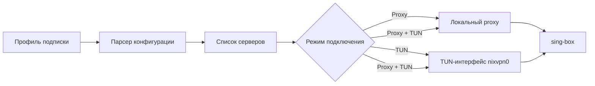

<div align="center">


# NixVPN

### Минималистичный VPN-клиент для NixOS

Управляйте подписками, серверами и подключением из аккуратного Electron-приложения — с нативной интеграцией в NixOS и движком `sing-box`.

<p>
  
  
  
  
</p>

</div>

> NixVPN — базовый VPN-клиент для системы NixOS. Проект находится в ранней разработке.

<details>
<summary><b>Содержание</b></summary>

- [Возможности](#возможности)
- [Как это устроено](#как-это-устроено)
- [Быстрый старт](#быстрый-старт)
- [Запуск через Nix](#запуск-через-nix)
- [NixOS-модуль](#nixos-модуль)
- [Поддерживаемые источники](#поддерживаемые-источники)
- [Структура проекта](#структура-проекта)
- [Обратная связь](#обратная-связь)

</details>

## Возможности

| | Что доступно |
| --- | --- |
| **Подписки** | Добавление по HTTPS-ссылке или share link, обновление, переименование и удаление профилей |
| **Локации** | Список серверов по профилям, определение страны и отображение задержки |
| **Режимы** | `Proxy`, `TUN` и `Proxy + TUN` |
| **Подключение** | Выбор сервера, connect/disconnect, uptime и автоматический выбор лучшего сервера при восстановлении |
| **Автоматизация** | Обновление подписок и проверка ping при запуске или по расписанию |
| **Настройки** | Локальный proxy-порт, автозапуск, интервалы обновления и восстановления соединения |
| **Диагностика** | Логи событий с уровнями `info`, `success`, `warning` и `error` |

## Как это устроено



Приложение хранит состояние локально, запускает `sing-box` с сгенерированной конфигурацией и очищает TUN-маршруты при отключении. Привилегированные операции в Linux выполняются через PolicyKit.

## Быстрый старт

### Требования

- Linux с установленным [NixOS](https://nixos.org/) — для `TUN`-режима;
- Node.js и npm — для локального запуска Electron-версии;
- `sing-box` — для работы VPN-подключения в dev-режиме.

### Electron-версия

```bash
npm install
npm start
```

Для запуска с логированием Electron:

```bash
npm run dev
```

Проверка синтаксиса JavaScript:

```bash
npm run check
```

## Запуск через Nix

Собрать пакет из корня проекта:

```bash
nix build
```

Запустить пакет напрямую:

```bash
nix run
```

Если используется готовая сборка проекта:

```bash
./app/NixVPN/bin/nixvpn
```

## NixOS-модуль

Flake экспортирует модуль `nixosModules.default`. Подключите его в конфигурации системы:

```nix
{
  inputs.nixvpn.url = "github:<owner>/<repository>";

  outputs = { self, nixpkgs, nixvpn, ... }:
    {
      nixosConfigurations.my-host = nixpkgs.lib.nixosSystem {
        modules = [
          nixvpn.nixosModules.default
          {
            programs.nixvpn.enable = true;
          }
        ];
      };
    };
}
```

Модуль добавляет пакет в `environment.systemPackages`, включает PolicyKit и разрешает NixVPN запускать свой TUN-helper для локального пользователя.

## Поддерживаемые источники

NixVPN умеет импортировать отдельные share links и подписки в распространённых форматах:

<details>
<summary><b>Поддерживаемые протоколы</b></summary>

`VLESS` · `VMess` · `Trojan` · `Shadowsocks` · `Hysteria 2` · `TUIC` · `WireGuard` · `SOCKS` · `HTTP`

</details>

Также распознаются subscription payloads в виде plain text, Base64, JSON и базового Clash YAML. Поддержка конкретного узла зависит от доступного mapping в `sing-box`.

> Совет: не публикуйте subscription URL и share links в issues, скриншотах или логах — они могут содержать приватные данные доступа.

## Структура проекта

```text
.
├── src/       # Electron main/preload/renderer и интерфейс приложения
├── nix/       # Nix-пакет, NixOS-модуль и TUN helper/supervisor
├── app/       # Локальная Nix-точка входа для сборки пакета
├── assets/    # Логотип и графические ресурсы
├── scripts/   # Скрипты локального запуска
└── flake.nix  # Flake-пакет и экспортируемый NixOS-модуль
```

## Обратная связь

Нашли баг или столкнулись с проблемой? Напишите в комментариях или свяжитесь напрямую: [@s1lentpacket](https://t.me/s1lentpacket).

<div align="center">

<sub>Built for NixOS · Powered by sing-box</sub>

</div>
